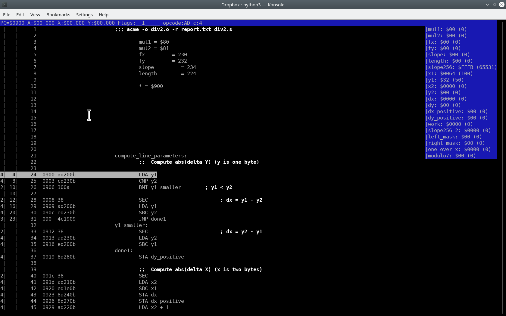

# A small assembler 6502 debugger

*(important : part of this code is (c) Jeremy Neiman, see : https://github.com/docmarionum1/py65emu , so the GPL license applies only to my stuff)*

Load your compiled code with your source (actually a "report") file and then execute step by step.
The debugger will automatically (ie lousy heuristics) detect interesting memory places and
show them as bytes or words. You can also use it to count cycles for specific portions of code.

Right now, only ACME 0.96 source code has been tested. It'll probably work with other versions.

